# AWS Fraud Risk Analytics

A credit card transaction fraud risk analysis project built on a serverless AWS analytics stack (Glue ETL → Parquet → Athena → Power BI), designed as an end-to-end portfolio project for a Junior Data Analyst skill level.

---

## Project Background

This project explores one core business question:

> **How do customer spending behaviors vary across time, category, and demographics — and how can abnormal patterns indicate potential fraud?**

Broken down into three analytical sub-questions:

1. **User Behavior Profiling** — What are customers' recurring spending patterns over time?
2. **High-Value Customer Identification** — Which customers contribute the most transaction volume/value?
3. **Fraud & Anomaly Detection** — How do fraudulent transactions differ from normal ones in amount, timing, and category?

---

## Architecture

```mermaid
flowchart LR
    A[Raw CSV Data<br/>Credit Card Transactions] -->|Upload| B[(Amazon S3<br/>Raw Zone)]
    B --> C[AWS Glue ETL Job<br/>Spark Cleaning<br/>Fix unescaped quotes / column misalignment]
    C -->|Write Parquet| D[(Amazon S3<br/>Cleaned Zone<br/>cleaned_data/transactions/)]
    D --> E[Glue Crawler<br/>crawler-cleaned-transactions]
    E -->|Generate Schema| F[(Glue Data Catalog<br/>financial_db.cleaned_transactions)]
    F --> G[Amazon Athena<br/>SQL Query & Validation]
    G --> H[Power BI<br/>3-Page Dashboard]

    style B fill:#e8f4fd,stroke:#4a90d9
    style D fill:#e8f4fd,stroke:#4a90d9
    style F fill:#fff3cd,stroke:#d9a441
    style G fill:#d4edda,stroke:#4ac47a
    style H fill:#f8d7da,stroke:#d94a6a
```



**Pipeline overview:**

| Stage | Service | Purpose |
|-------|---------|---------|
| 1. Raw storage | Amazon S3 | Stores unprocessed credit card transaction CSVs |
| 2. Data cleaning | AWS Glue ETL (Spark) | Fixes formatting issues (e.g. unescaped quotes causing column misalignment), converts to Parquet |
| 3. Metadata crawling | AWS Glue Crawler | Automatically infers schema and registers it in the Glue Data Catalog |
| 4. Query & analysis | Amazon Athena | Serverless SQL exploration and validation of cleaned data |
| 5. Visualization | Power BI | Interactive dashboard mapped to the three business questions |

---

## Tech Stack

- **Cloud Platform**: AWS (S3, Glue ETL, Glue Crawler, Athena, IAM)
- **Data Formats**: CSV (raw) → Parquet (cleaned)
- **Query Engine**: Amazon Athena (Presto engine, serverless SQL)
- **Visualization**: Power BI
- **Metadata Management**: AWS Glue Data Catalog

> This project intentionally uses a lightweight serverless analytics stack (Glue + Athena) rather than a more advanced modern data stack (e.g. dbt / Iceberg), to reflect a practical, entry-level Junior Data Analyst skill set and workflow.

---

## Core Analysis Questions

1. Daily / weekly transaction trends
2. Spending distribution by category
3. Top high-value customers
4. Average transaction amount by gender
5. Fraud vs. non-fraud transaction comparison (amount, timing, category)

---

## Suggested Project Structure

```
aws-fraud-risk-analytics/
├── README.md
├── etl/
│   └── glue_etl_job.py          # Glue Spark cleaning script
├── sql/
│   ├── validation_queries.sql   # Athena data validation queries
│   └── analysis_queries.sql     # Five core analysis queries
├── dashboard/
│   └── fraud_risk_dashboard.pbix # Power BI dashboard file
└── docs/
    └── architecture.png         # Static architecture diagram (optional)
```

---

## Project Progress

- [x] Finalized tech stack (Glue ETL → Parquet → Athena)
- [x] Developed Glue ETL cleaning script (handles malformed source data)
- [x] Landed cleaned data in S3 (Parquet format)
- [x] Configured and ran Glue Crawler
- [x] Configured IAM permissions (AmazonS3FullAccess)
- [ ] Validated Athena table schema / row counts
- [ ] Ran the five core analytical SQL queries
- [ ] Built the 3-page Power BI dashboard

---


